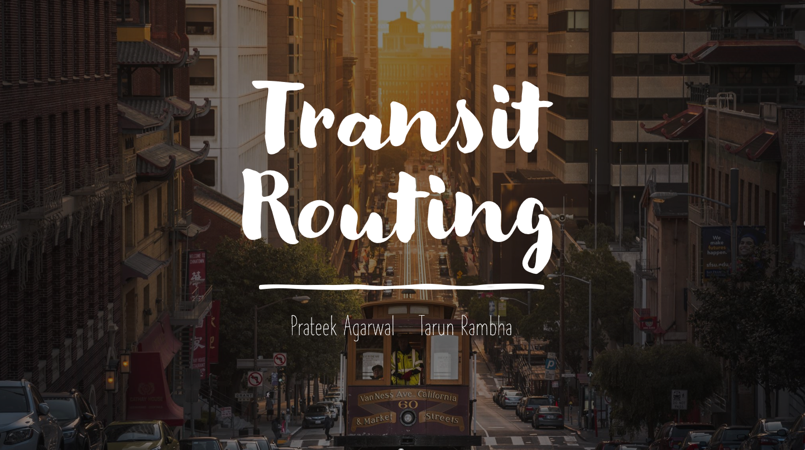

## Table of Contents

- [Introduction](#Introduction)
- [List of Algorithms](#List-of-Algorihtms)
- [Usage Instructions](#usage-instructions)
- [Contributing](#contributing)
- [Creators](#Creators)
- [References](#References)
- [Copyright and license](#Copyright-and-license)

### Introduction 
This repository provides various efficient algorithms to solve bicriteria shortest path problems in public transit routing. For documentation refer the link below

- Website: [https://transnetlab.github.io/transit-routing/html/index.html](https://transnetlab.github.io/transit-routing/html/index.html)

We mainly focus on two popular approaches: Round-Based Public Transit Routing (RAPTOR) and Trip-Based public
Transit Routing (TBTR) working on arrival time and number of transfers as the two optimization criteria.
Apart from the already published HypRAPTOR, we also include our variant of HypTBTR. Furthermore, both HypRAPTOR and HypTBTR have been extended using multilevel partitioning (MhypTBTR and MhypRAPTOR).

Additionally, to make the RAPTOR and TBTR approach more practical, we also include One-To-Many rTBTR and One-To-Many rRAPTOR. These not only reduce the preprocessing times of the partitioning variants but also significantly
outperform the existing approach for location-based queries (as a location can have multiple stops near it)

Switzerland's public transit network has been provided as a test case. The figure below shows the transit stop location (left) and 4-way partitioning using [KaHyPar](https://github.com/kahypar/kahypar) (right).

### List of Algorithms
|  Algorithm                 | SOURCE | Status             | Comments |
|----------------------------|---|--------------------|---|
| RAPTOR                     | [link](https://pubsonline.informs.org/doi/abs/10.1287/trsc.2014.0534) | Complete           |
| TBTR                       | [link](https://link.springer.com/chapter/10.1007/978-3-662-48350-3_85) | Complete           |
| rRAPTOR                    | [link](https://pubsonline.informs.org/doi/abs/10.1287/trsc.2014.0534) | Complete           |
| rTBTR                      | [link](https://link.springer.com/chapter/10.1007/978-3-662-48350-3_85) | Complete           |
| One-To-Many rRAPTOR        | [link](https://arxiv.org/abs/2111.06654) | To be updated soon |
| One-To-Many rTBTR          | [link](https://arxiv.org/abs/2111.06654) | Complete           |
| HypRAPTOR                  | [link](https://drops.dagstuhl.de/opus/volltexte/2017/7896/) | Complete           |
| HypTBTR                    |  [link](https://arxiv.org/abs/2111.06654) | Complete           |
| MHypTBTR                   | [link](https://arxiv.org/abs/2111.06654) | Complete           |
| MHypTBTR                   | [link](https://arxiv.org/abs/2111.06654) | Complete           |
| Transfer Patterns          | [link](https://link.springer.com/chapter/10.1007/978-3-642-15775-2_25) | Complete           |
| Scalable Transfer Patterns | [link](https://epubs.siam.org/doi/abs/10.1137/1.9781611974317.2) | To be updated soon |

### Usage Instructions
Refer [https://transnetlab.github.io/transit-routing/html/index.html](https://transnetlab.github.io/transit-routing/html/index.html). 

### Contributing
We welcome all suggestions from the community. If you wish to contribute or report any bug please contact the creaters or create an issue on [issue tracking system](https://github.com/transnetlab/transit-routing/issues).
### Creators
- **Prateek Agarwal**
    - Ph.D. at Indian Institute of Science (IISc) Bengaluru, India.
    - Mail Id: prateeka@iisc.ac.in
    - <https://sites.google.com/view/prateek-agarwal/>

- **Tarun Rambha**
    - Assistant Professor in the Department of Civil Engineering and the Center for Infrastructure, Sustainable Transportation and Urban Planning (CiSTUP) at Indian Institute of Science (IISc) Bengaluru, India.
    - Mail Id: tarunrambha@iisc.ac.in
    - <http://civil.iisc.ernet.in/~tarunr/>

### References
- [Delling, D., Pajor, T. and Werneck, R.F., 2015. Round-based public transit routing. Transportation Science, 49(3), pp.591-604.](https://pubsonline.informs.org/doi/abs/10.1287/trsc.2014.0534) 
- [Delling, D., Dibbelt, J., Pajor, T. and Zündorf, T., 2017. Faster transit routing by hyper partitioning. In 17th Workshop on Algorithmic Approaches for Transportation Modelling, Optimization, and Systems (ATMOS 2017). Schloss Dagstuhl-Leibniz-Zentrum fuer Informatik.](https://drops.dagstuhl.de/opus/volltexte/2017/7896/)
- [Witt, S., 2015. Trip-based public transit routing. In Algorithms-ESA 2015 (pp. 1025-1036). Springer, Berlin, Heidelberg.](https://link.springer.com/chapter/10.1007/978-3-662-48350-3_85)
- [Agarwal, P., & Rambha, T., 2021. Scalable Algorithms for Bicriterion Trip-Based Transit Routing (_Under Review_).](https://arxiv.org/abs/2111.06654)
- [Bast, Hannah, Matthias Hertel, and Sabine Storandt. "Scalable transfer patterns." 2016 Proceedings of the Eighteenth Workshop on Algorithm Engineering and Experiments (ALENEX). Society for Industrial and Applied Mathematics, 2016.](https://link.springer.com/chapter/10.1007/978-3-642-15775-2_25)
- [Bast, Hannah, et al. "Fast routing in very large public transportation networks using transfer patterns." European symposium on algorithms. Springer, Berlin, Heidelberg, 2010.](https://epubs.siam.org/doi/abs/10.1137/1.9781611974317.2)
### Copyright and license
The content of this repository is bounded by MIT License. For more information see
[COPYING file](https://github.com/transnetlab/transit-routing/blob/main/LICENSE)
